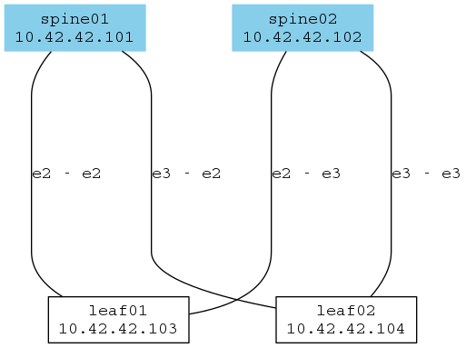

# Week 1 Lab

This is just a simple leaf/spine fabric with four Arista vEOS nodes.

I'm using an out-of-band network for controlling the boxes with Ansible.

## OOB network

* vboxnet5 - Ethernet 1 (VRF MGMT)
* 10.42.42.0/24
* vEOS boxes use 10.42.42.10n/24 as their management IP ## Topology

## Topology

## Command output from Ansible raw module

	PLAY [Run show version] ********************************************************

	TASK [raw] *********************************************************************
	changed: [spine02]
	changed: [leaf02]
	changed: [spine01]
	changed: [leaf01]

	TASK [debug] *******************************************************************
	ok: [spine01] => {
	    "version.stdout_lines": [
		"\u001b[5nArista vEOS",
		"Hardware version:    ",
		"Serial number:       ",
		"System MAC address:  0800.2711.748b",
		"",
		"Software image version: 4.17.2F",
		"Architecture:           i386",
		"Internal build version: 4.17.2F-3696283.4172F",
		"Internal build ID:      c6362f13-ae6d-4c88-b5fd-4678d66018ab",
		"",
		"Uptime:                 22 minutes",
		"Total memory:           1893460 kB",
		"Free memory:            931736 kB",
		""
	    ]
	}
	ok: [spine02] => {
	    "version.stdout_lines": [
		"\u001b[5nArista vEOS",
		"Hardware version:    ",
		"Serial number:       ",
		"System MAC address:  0800.2780.bf80",
		"",
		"Software image version: 4.17.2F",
		"Architecture:           i386",
		"Internal build version: 4.17.2F-3696283.4172F",
		"Internal build ID:      c6362f13-ae6d-4c88-b5fd-4678d66018ab",
		"",
		"Uptime:                 8 minutes",
		"Total memory:           1893460 kB",
		"Free memory:            887552 kB",
		""
	    ]
	}
	ok: [leaf01] => {
	    "version.stdout_lines": [
		"\u001b[5nArista vEOS",
		"Hardware version:    ",
		"Serial number:       ",
		"System MAC address:  0800.2707.081e",
		"",
		"Software image version: 4.17.2F",
		"Architecture:           i386",
		"Internal build version: 4.17.2F-3696283.4172F",
		"Internal build ID:      c6362f13-ae6d-4c88-b5fd-4678d66018ab",
		"",
		"Uptime:                 6 minutes",
		"Total memory:           1893460 kB",
		"Free memory:            932592 kB",
		""
	    ]
	}
	ok: [leaf02] => {
	    "version.stdout_lines": [
		"\u001b[5nArista vEOS",
		"Hardware version:    ",
		"Serial number:       ",
		"System MAC address:  0800.279e.ed2f",
		"",
		"Software image version: 4.17.2F",
		"Architecture:           i386",
		"Internal build version: 4.17.2F-3696283.4172F",
		"Internal build ID:      c6362f13-ae6d-4c88-b5fd-4678d66018ab",
		"",
		"Uptime:                 4 minutes",
		"Total memory:           1893460 kB",
		"Free memory:            932656 kB",
		""
	    ]
	}

	PLAY RECAP *********************************************************************
	leaf01                     : ok=2    changed=1    unreachable=0    failed=0
	leaf02                     : ok=2    changed=1    unreachable=0    failed=0
	spine01                    : ok=2    changed=1    unreachable=0    failed=0
	spine02                    : ok=2    changed=1    unreachable=0    failed=0

